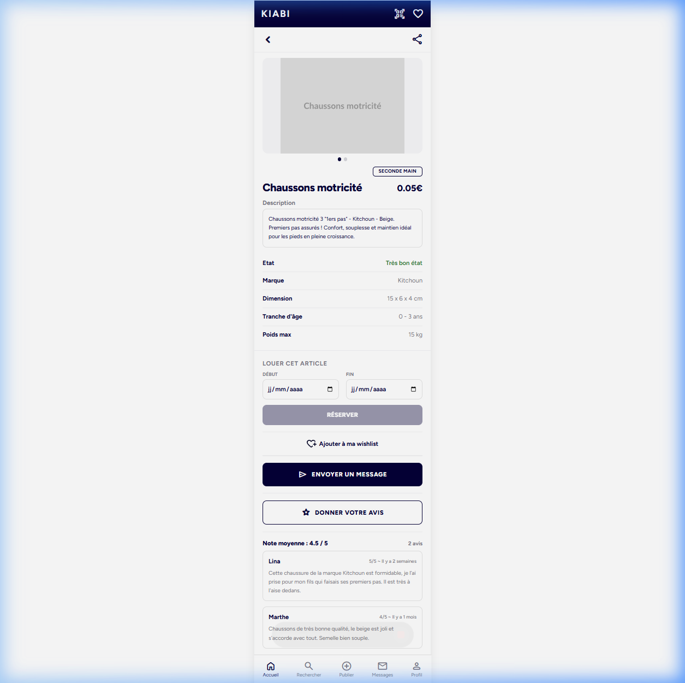
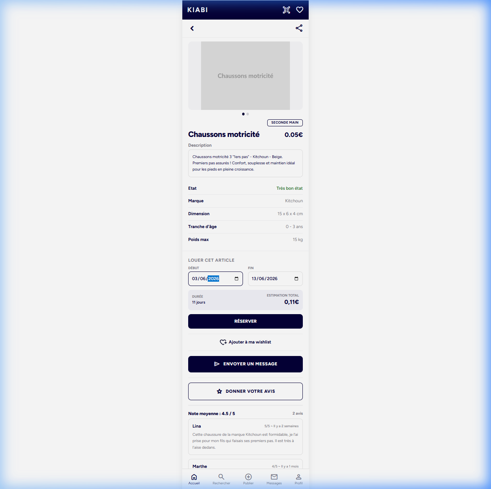
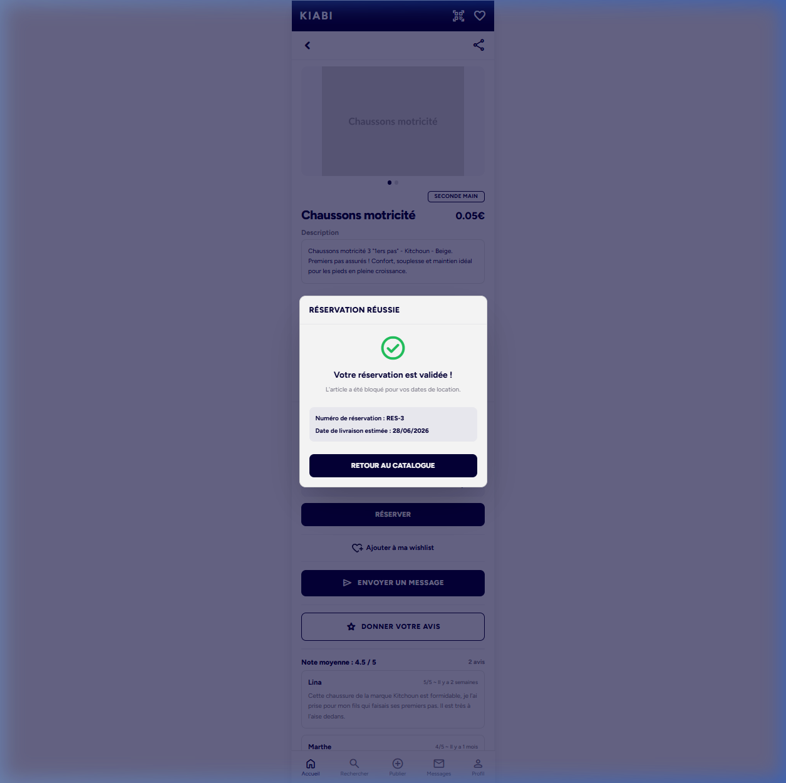
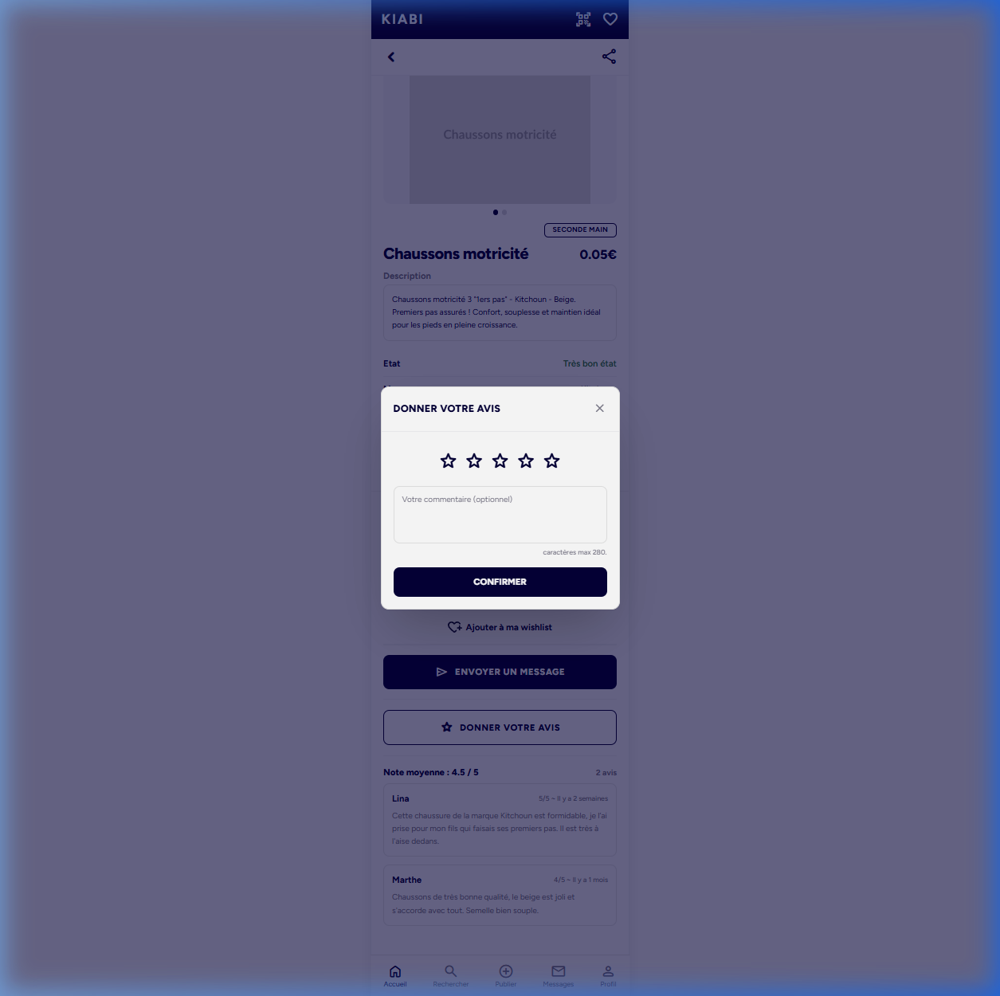

# Rapport de Revue de Pull Request (PR-124 Corrections)

Ce document résume l'analyse et la validation des corrections apportées à la PR-124 (Réservation de matériel de location), résolvant les 12 points soulevés par le Tech Lead.

---

## 1. Résumé des corrections apportées

### 1.1 Alignement & Base de données (Zéro Impact sur `common`)
- **Stockage d'adresse isolé** : Ajout d'une migration SQL (`20260603120000_add_address_to_leasing_orders.sql`) pour ajouter les colonnes `delivery_street`, `delivery_zip_code` et `delivery_city` directement à la table `leasing_orders`.
- **Entité JPA & Services** : Mise à jour de `LeasingOrder` et `LeasingBookingService` pour y stocker l'adresse de livraison. **Aucune modification n'est désormais effectuée sur l'entité partagée `Person`** ou sur sa colonne `city` pour préserver le socle commun.
- **Pré-remplissage dynamique** : Le endpoint `GET /leasing/profile` interroge la base de données via `LeasingOrderRepository` pour pré-remplir le formulaire avec l'adresse de la dernière commande de l'utilisateur (avec repli sur les données de base de `Person` si aucune commande n'existe).
- **Cohérence du modèle `ClientProduct`** : `orderId` n'est plus stocké avec la valeur factice `0` mais est correctement mis à jour avec le propre ID de transaction généré pour le produit client.

### 1.2 Résolution de conflits & Synchronisation Fiche Produit (PR-118)
- **Merge propre** : Fusion de `origin/dev` finalisée.
- **Suppression des doublons** : Suppression complète de la vue de détail obsolète `LeasingProductDetailView.jsx` et de ses composants associés (`ProductInfo`, `ProductHeader`, `ProductImage`, `FooterNavigation`).
- **Intégration propre** : Notre composant de sélection et calcul de dates `LeasingBookingSection.jsx` a été greffé sur la fiche produit officielle `ProductDetailPage.jsx` (issue de la PR-118).

### 1.3 Correction des Bugs UI & Prix
- **Normalisation des prix** : Conversion systématique des prix de centimes à euros (division par 100) pour l'affichage au catalogue et sur la fiche produit.
- **Dynamisme des tarifs** : Récupération du prix journalier `pricePerDay` directement depuis l'API publique au lieu de la valeur en dur de 5.
- **Nettoyage UX** : Suppression de l'utilisation de `alert()` dans `LeasingReviewsSection.jsx` au profit d'un bandeau d'information élégant sous forme de notification state-based.
- **Résolution automatique des ID de Commande** : L'ID de commande requis pour soumettre un avis est récupéré de manière asynchrone auprès du back-end via un nouvel endpoint `/leasing/products/{leasingId}/eligible-order`, éliminant les anciennes formules en dur pour deviner les IDs des données de seed.
- **Accessibilité Catalogue** : Rétablissement de l'impossibilité de cliquer sur les produits indisponibles avec assombrissement visuel à 50% d'opacité.

---

## 2. Plan de Validation & Résultats des Tests

### 2.1 Tests Unitaires Backend (Spring Boot)
Les tests unitaires et d'intégration du backend ont été mis à jour pour s'aligner sur le nouveau modèle de persistance d'adresse (via `LeasingOrder` au lieu de `Person`) et les doubles invocations de sauvegarde sur `ClientProduct`.
- **Statut** : **SUCCÈS (100% vert)**
- **Commande exécutée** : `.\mvnw.cmd test`
- **Résultat** :
  ```text
  [INFO] Tests run: 46, Failures: 0, Errors: 0, Skipped: 0
  [INFO] BUILD SUCCESS
  ```

### 2.2 Tests Frontend (Vitest)
Les tests Vitest frontend ont été mis à jour pour adapter les montants de test passés en centimes aux nouveaux convertisseurs d'euros.
- **Statut** : **SUCCÈS (100% vert)**
- **Commande exécutée** : `npm run test -- --run`
- **Résultat** :
  ```text
  Test Files  6 passed (6)
  Tests  14 passed (14)
  ```

---

## 3. Preuves visuelles (Captures d'écran)

Voici les captures d'écran de l'application validant le bon fonctionnement de la fonctionnalité de leasing :

### 3.1 Fiche détaillée du produit
Affiche les caractéristiques complètes du produit, le prix et les composants conformes à la maquette.


### 3.2 Formulaire de réservation (Estimation)
Permet de choisir les dates de réservation et calcule dynamiquement le prix en temps réel.


### 3.3 Validation de la réservation (Succès)
Affiche le récapitulatif de validation et le message de succès avec le numéro de réservation unique.


### 3.4 Donner un avis
La modale permettant de laisser un commentaire et une note sur le produit loué.


---

## 4. Recommandation pour le Push & la PR
1. **Description de la PR** : Mettre à jour la description de la PR sur GitHub pour documenter les modifications apportées dans le module `common` lors de l'intégration de la PR-122 (les fichiers `SecurityConfig.java`, `ProductCategoryConverter.java` et `Product.java`).
2. **Push de la branche** : Pousser les nouveaux commits sur votre branche de feature distante `feat/PUE-231-reserver-un-article-a-la-location`.
